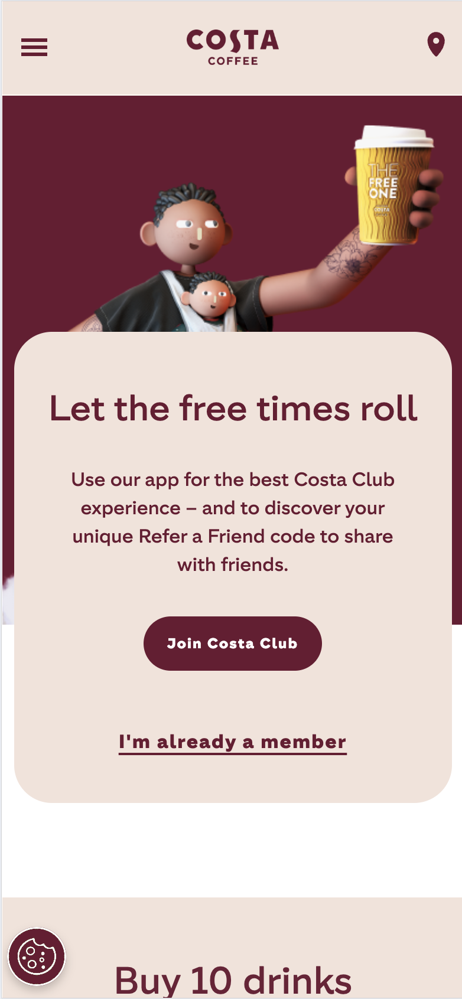
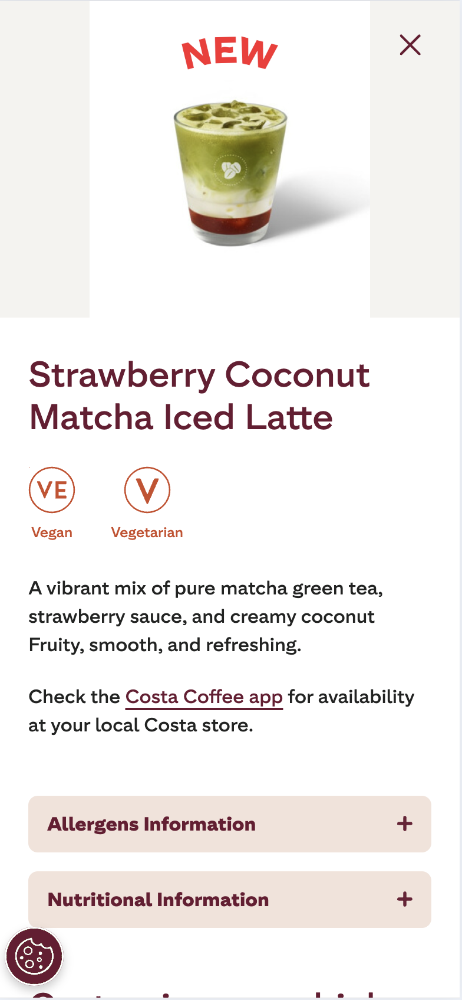
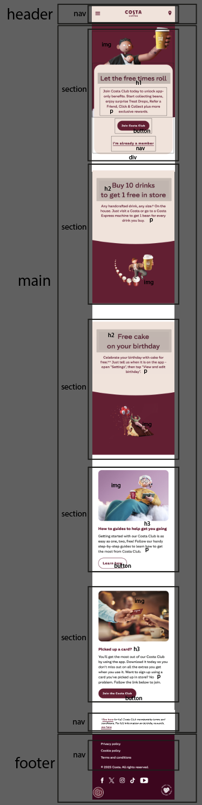
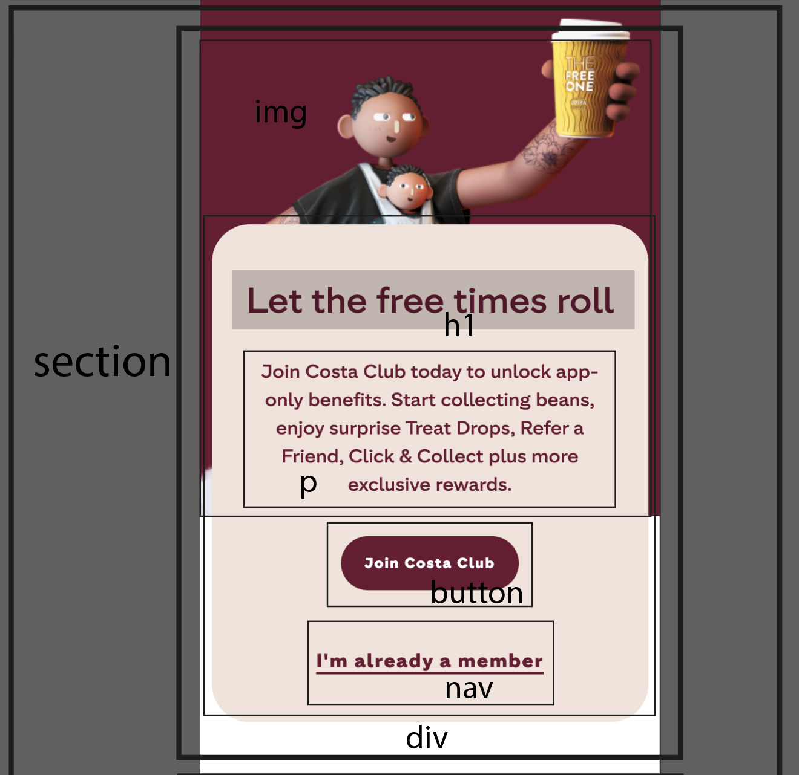
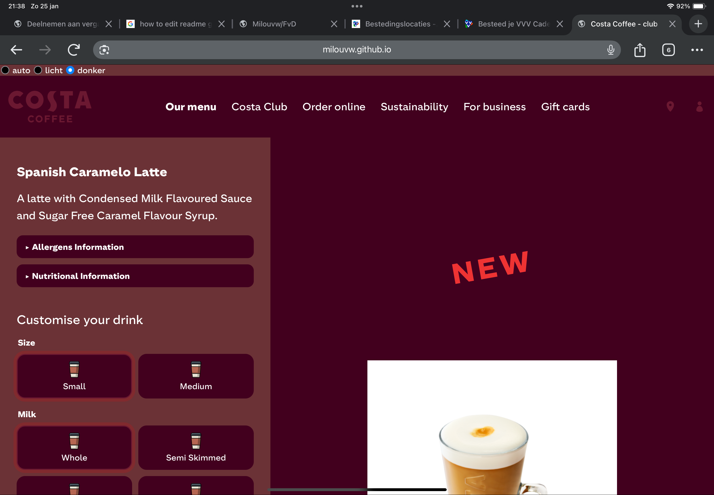

# Procesverslag
Markdown is een simpele manier om HTML te schrijven.  
Markdown cheat cheet: [Hulp bij het schrijven van Markdown](https://github.com/adam-p/markdown-here/wiki/Markdown-Cheatsheet).

Nb. De standaardstructuur en de spartaanse opmaak van de README.md zijn helemaal prima. Het gaat om de inhoud van je procesverslag. Besteedt de tijd voor pracht en praal aan je website.

Nb. Door *open* toe te voegen aan een *details* element kun je deze standaard open zetten. Fijn om dat steeds voor de relevante stuk(ken) te doen.

## Jij

  
uitwerken voor kick-off werkgroep

  ### Auteur:
  Milou van Wijk

  #### Je startniveau:
  Rood

  #### Je focus:
  responsiveness
 

## Je website

  
uitwerken voor kick-off werkgroep

  ### Je opdracht:
  

  #### Screenshot(s) van de eerste pagina (small screen): 
  homepagina costa
  

  #### Screenshot(s) van de tweede pagina (small screen):
  koffiepagina costa
  
 

## Toegankelijkheidstest 1/2 (week 1)

  
uitwerken na test in 2e werkgroep

  ### Bevindingen
  
  Costa Club Pagina  
    Headings:  
      -Geen h2 en h5  
      -H1 is een slogan, verteld niet waar de hele pagina over gaat  
      -Footer is alleen maar h6, terwijl er ook geen h5 is  
      -sommige koppen zijn niet duidelijk genoeg over wat voor info daar onder te vinden valt: "want to know more?"  
    Links  
      -Sommige links heten "See here" of "Ask away". Het is niet duidelijk waar die links naartoe gaan.  
  
  Detailpagina aardbei matcha  
    Headings:  
      -2x een h1  
      -geen h3 - h5  
      -betreffende titels zijn beter dan de andere pagina  
    Links  
      -veel dubbele links. Sommige komen vaker voor: "Sustainability". De namen kunnen aangepast  
      worden om de Sustainebility van het betreffende product beter naar voren te laten komen.

  Emulate visual deficiencies  
  -Bij blurred vision is het lastig om de kleinere tekst te lezen  
  -Bij Reduced contrast is de site nog goed te lezen en te gebruiken
  -Bij Protanopia vond ik het interessant, aangezien de site veel rood bevat. Tot mijn verbazing is de site gewoon goed te lezen, alleen is er heel veel grijs/zwart met een klein beetje geel.  
  -Bij Deuteranopia is er net wat meer geeltinten. Toch is de site ook goed te bezoeken.  
  -Bij Tritanopia is de gehele site wat feller rood, maar nog niet storend zodat het vervelend is te lezen.  
  -Bij Achromatopsia is de site ook goed te bezoeken. In het algemeen zijn er veel verschillende tinten gebruikt en je ziet veel verschillende grijs tinten hierdoor.

## Breakdownschets (week 1)

  
uitwerken na afloop 3e werkgroep

  ### de hele pagina: 
  

  ### dynamisch deel (bijv menu): 
  

## Voortgang 1 (week 2)

  
uitwerken voor 1e voortgang

  ### Stand van zaken
  Mijn grootste vooruitgang in week 1 was de menubalk. Dit leek voor mij eerst onmogelijk, maar na de eerste week waarin we met de hele klas menubalken met nav gingen maken vond ik het ook heel interessant. Het klonk best logisch, van 3 strepen 1 onzichtbaar maken, en de andere 2 draaien naar een kruis. Ik wist niet dat hoe code lijkt, het soms ook zo vertaald is in de code. Hier begon ik het vak ook leuker te vinden, nadat ik bij de lessen kon zijn en het echt begreep.

  ### Agenda voor meeting
  ik heb geen meeting gehad aangezien ik in een ander ritme heb gewerkt.

## Voortgang 2 (week 3)

  
uitwerken voor 2e voortgang

  ### Stand van zaken
  Met de tweede voortgang was ik nieg veel verder dan met de eerste voortgang. dit eigenlijk omdat ik heel lang bezig ben geweest met sectie 1,2 3n 3 van de eerste pagina. Costa houdt zelf geen rekening met een heel klein of middelatig scherm. Hierdoor werd het plaatje gelijk aan het begin verschoven weergegeven, ik wilde dat anders maken. Uiteinelijk was dat mij gelukt, en als ik het nu nog een keer moet doen lukt het sneller, maar ik had veel moeite met code.

  ### Agenda voor meeting
  ik heb geen meeting gehad

## Toegankelijkheidstest 2/2 (week 4)

  
uitwerken na test in 9e werkgroep

  ### Bevindingen
  Lijst met je bevindingen die in de test naar voren kwamen (geef ook aan wat er verbeterd is):

## Voortgang 3 (week 4)

  
uitwerken voor 3e voortgang

  ### Stand van zaken
  Wat ik bij het 1na laatste gesprek heel openbarend vond was het grid systeem voor de hoofdpagina van mijn website. Daar liep ik echt al heel lang mee te strugglen. Ik denk dat ik uit mij zelf alles wel heb kunnen proberen, maar dat ik dit net moest weten. Dus het jammere was de tijd die zat in de 1e en 2e sectie, ik die ook in de 2e pagina had kunnen steken. Ook vond ik het lastig alles om te zetten van div's naar iets anders. Maar ik was helemaal vergeten dat articles bestaan haha. Dus hierna heb ik dat gelijk aangepast. Wel was ik trots op de halve circkel die dan meebeweegt naar groot scherm. Ik heb lang nagedacht over hoe dat precies kon, maar met de 0/100% regels lukte het eiegnlijk gelijk. de plaatsing vond ik moeilijk, maar uiteindelijk ging dat wel goed!

  ### Agenda voor meeting
Ik heb niet met een groepje gezeten

## Eindgesprek (week 5)

  
uitwerken voor eindgesprek

  ### Je uitkomst - karakteristiek screenshots:
  
  
  
  
  
  
  
  

  ### Dit ging goed/Heb ik geleerd: 
  Ik vond de 2e pagina echt heel snel gaan. Ik begreep hoe form, en details werkte. Ik ben daarom ook blij dat ik dit nog op tijd af heb kunnen krijgen. Ik had verwacht dat dat teveel in een korte tijd zou zijn. Ik vind het leuk om te zien dat zoiets simpels zoals details, en den met de vormgeving, al weer wat leuks toevoegd aan de site. Ook ben ik stiekem trots op de easter-eggs. Dat vond ik zooooo leuk om te doen en een beetje mee te klieren.

  

  ### Dit was lastig/Is niet gelukt:
  Ik baal dat ik de kleuren niet goed voor elkaar heb gekregen met de dark/light modes. Ik kan niet achterhalen wat hier de oorzaak van is en waarom de kleuren niet meer helemaal kloppen. Daar baal ik wel echt van. Aangezien ik dit niet eerder had kunnen bespreken bij eerdere voortgangen, is dit jammer, maar ben al trots op het resultaat. Ook vond ik het balen dat ik heeeeeeeeel veel tijd kwijt was aan sectie 2 en 3 op pagina 1. Na het laatste gesprek ws het gelijk duidelijk en klikte het wel. Maar toen moest ik het toepassen, en oh, wat heb ik geweten dat dat niet zo 1,2,3 gedaan was.

  

## Bronnenlijst

  
continu bijhouden terwijl je werkt

 1. Mdn website. Alles betreft elementen, details, figure, maar ook de simpele dingen die weer even herhaald moesten worden zoals articles.
 2. W3Scools. Voor alles waar ik meer over wilde lezen als ik het niet helemaal begreep. Of simpele voorbeelden van kleuren en divs aanspreken met grid.
 3. chatgpt: extra, alleen om code te begrijpen. Dus vragen, "leg me uit hoe een article werkt en wanneer en hoe je het gebruikt". Dit hielp meer om dingen te begrijpen die ik niet eerder heb gebruikt, zoals "details".

